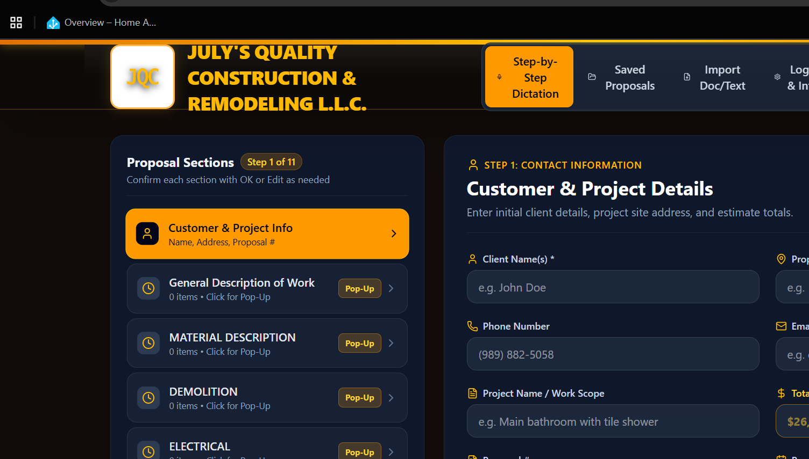

# Proposal Builder

> A voice-and-dictation-friendly construction proposal generator — turn a phone call's worth of rambling job notes into a clean, professional, print-ready client proposal.

**[Live demo →](https://proposal-builder.crackerbox.app)**



## What it does

Proposal Builder is a step-by-step wizard for building out formal construction proposals in the field, without ever opening a word processor. Speak or type raw notes into any scope section, and AI cleans them up into professional line items automatically.

- **Step-by-step wizard**: contact info → scope categories → review → print/PDF
- **Voice dictation support** for hands-free note capture on-site
- **AI line-item formatting** — turns raw, casual dictation into clean, professional scope-of-work language automatically
- **Document import** — paste in an old proposal or template and have it auto-parsed into structured sections
- Category system for Demolition, Electrical, Plumbing, Carpentry, Allowances, and fully custom scope sections
- One-click **Print / PDF** export of the finished proposal

## How the AI formatting works

Two Netlify Functions handle the AI side server-side (API key never exposed to the browser):

- **`/api/format-section`** — takes raw dictated/typed notes for a scope category and returns clean, professional line items
- **`/api/parse-document`** — takes a pasted document or old proposal and extracts structured client info + scope sections

Both call the Gemini API and return structured JSON that renders directly into the proposal.

## Tech stack

- React + TypeScript, Vite
- Netlify Functions (Express + `serverless-http`) for the AI formatting layer
- Google Gemini API for text formatting & document parsing
- Deployed on Netlify

## Project structure

```
src/                  React app source
netlify/functions/    Serverless API (AI formatting + document parsing)
netlify.toml          Netlify build & functions configuration
```

## Local development

```bash
npm install
npm run dev
```

Requires a `GEMINI_API_KEY` environment variable for AI formatting to function (set as a Netlify environment variable in production — never committed to the repo).

## Deployment

Auto-deploys to Netlify on every push to `main`:

```
build command: npm run build
publish dir:   dist
functions dir: netlify/functions
```

---

Built by [Tim Graham](https://github.com/joecracker) — part of the [crackerbox.app](https://crackerbox.app) project family.
